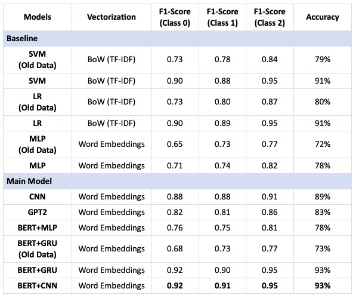

# Noffence: Hate Speech and Offensive Language Detection on Social Media

Noffence is a project focused on the detection of hate speech and offensive language on social media platforms, such as Twitter. The project was developed between September and December 2022 and employs various machine learning models to classify text into hate speech, offensive language, or neutral speech categories.

## Project Overview

Hate speech is a growing concern due to its rapid spread on social media and other online platforms. This project aims to develop a responsive, flexible, and privacy-conscious solution for detecting hate speech automatically. Unlike conventional human censorship, our approach leverages advanced machine learning techniques to improve detection accuracy while protecting user privacy.

## Repository Structure

- **data/**  
  Contains datasets used for training, validation, and testing the models.

- **data_preprocessing.ipynb**  
  Jupyter Notebook for data cleaning and balancing to prepare datasets for model training.

- **baselines.ipynb**  
  Jupyter Notebook for training three baseline models using traditional machine learning techniques.

- **CNN.ipynb**  
  Jupyter Notebook for implementing a Convolutional Neural Network (CNN) model.

- **GPT2.ipynb**  
  Jupyter Notebook for implementing the GPT-2 model for text classification.

- **BERT_GRU.ipynb**  
  Jupyter Notebook for implementing a BERT model with GRU blocks.

 The following picture shows the architecture of our model. 

## Models and Methodology

We explored both traditional machine learning models and advanced neural network architectures, including:

- **Baseline Models**: Logistic Regression, Support Vector Machines (SVM), and Multi-Layer Perceptron (MLP) with TF-IDF and Word2Vec vectorizations.
- **Advanced Models**: Convolutional Neural Networks (CNN), GPT-2, and BERT with various configurations, such as BERT with GRU and CNN blocks.

The models were trained and evaluated using a balanced dataset derived from multiple sources, including hand-labeled tweets and publicly available datasets.

## Results and Insights

Our best-performing model, BERT with CNN blocks, achieved an accuracy of 93%, outperforming traditional methods like SVM and Logistic Regression, which also performed well with accuracies around 91%. The project demonstrated the effectiveness of transformer-based models in reducing misclassification between hate speech and offensive language.

## Additional Information

Unfortunately, due to contracting COVID-19, I was unable to present the project in person. However, I delivered the presentation online. You can find the report and presentation slides at the following link:

[Project Report and Presentation](https://www.eecg.utoronto.ca/~jayar/ece1786.2022/noffence.html)